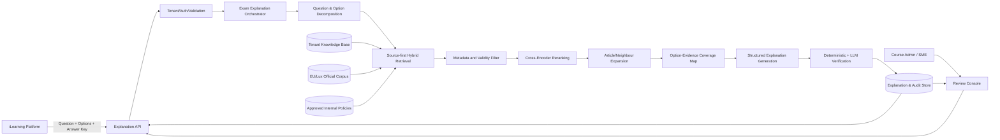

# 卢森堡金融与咨询行业 GDPR 考试解释系统扩展 PRD

| 项目 | 内容 |
|---|---|
| 文档状态 | Draft v1.0 |
| 产品形态 | 嵌入现有 iLearning 平台的 RAG 解释服务 |
| 目标行业 | 卢森堡金融服务与咨询行业 |
| 目标语言 | 英文、法文；中文用于内部演示或特定客户 |
| 目标读者 | 产品负责人、GDPR/Legal SME、学习团队、架构师、后端与前端工程师、QA |

## 1. 执行摘要

客户已有成熟的 iLearning 平台，能够完成课程学习、考试编排、答题、评分和学习记录管理。当前主要痛点是：考试结果页只提供一到两句笼统说明，学习者无法理解正确选项的法律依据，也无法辨别错误选项错在何处。

本项目不替代 iLearning，而是在现有 RAG 系统之上新增一个“答案解释服务”。iLearning 在答题结束后，将题目、全部选项、客户批准的标准答案、指定出处和学习上下文发送给该服务；服务从客户课程材料、EU GDPR、卢森堡数据保护法规、CNPD/CSSF/EDPB 官方材料及获批内部政策中检索证据，返回结构化、可引用、可审核的教学解释。

系统的核心原则是：

1. **标准答案锁定**：系统解释已批准答案，不自行重新判题。
2. **证据优先**：每个主要结论必须能映射到具体来源、条款或页码。
3. **逐项解释**：同时说明正确项为何正确、每个错误项为何错误。
4. **冲突不掩盖**：客户答案与现行权威来源疑似冲突时，不强行生成，而是标记为人工复核。
5. **教学而非法律意见**：输出用于学习，不作为对具体事实的法律意见。
6. **租户隔离和隐私保护**：不同客户的题库、材料、日志和反馈不得交叉检索或泄露。

## 2. 背景与问题定义

### 2.1 当前用户体验

典型流程为：

1. 学习者完成 GDPR 课程；
2. 学习者回答选择题；
3. iLearning 显示正确或错误；
4. 系统只显示简短结论，例如“B 正确，因为发生高风险处理时需要开展 DPIA”；
5. 学习者仍然不知道适用条件、法律出处、其他选项错在哪里，以及实际工作中如何判断。

### 2.2 根因

- 解释由题库作者静态填写，长度和质量不一致；
- 静态解释难以及时跟随法规、监管指南和内部政策更新；
- 题目、选项和证据之间没有结构化映射；
- 当前普通 RAG 以开放式问答为中心，没有标准答案锁定和选项级证据覆盖；
- 现有在线指标不足以证明解释在法律依据和教学质量上的正确性。

### 2.3 机会

通过 RAG 自动生成可追溯的详细解释，可以在保留客户题库治理权的同时：

- 提高学习者对 GDPR 规则和业务应用的理解；
- 减少课程作者逐题编写长解释的成本；
- 让解释随获批知识库版本更新；
- 通过引用、反馈和人工复核建立持续改进闭环；
- 为银行、基金管理公司、PSF、支付机构及咨询服务商提供按机构类型定制的说明。

## 3. 产品目标与非目标

### 3.1 产品目标

| ID | 目标 |
|---|---|
| G1 | 为每道已提交的选择题生成易于学习的结构化解释 |
| G2 | 为正确选项和每个错误选项提供独立理由 |
| G3 | 主要结论附带可定位到原文的引用 |
| G4 | 支持 Luxembourg/EU、机构类型、课程、语言和生效日期过滤 |
| G5 | 在证据不足、来源冲突或答案疑似过期时自动进入人工复核 |
| G6 | 提供可重复的离线评估，真实测量 Recall@K 和解释正确性 |
| G7 | 通过 API 嵌入客户现有 iLearning，而非改变其核心考试流程 |

### 3.2 非目标

- 不替代客户的 LMS/iLearning 平台；
- 不负责用户注册、课程分配、考试计时和成绩计算；
- MVP 不让模型自主修改客户批准的正确答案；
- 不把生成结果定位为个案法律意见；
- 不在未经批准的互联网内容上实时自由检索并直接回答；
- MVP 不自动发布未经人工审核的新题目或新标准答案。

## 4. 用户与角色

| 角色 | 主要诉求 | 权限 |
|---|---|---|
| 学习者 | 理解答案、依据及实际应用 | 查看已发布解释、提交有用/无用反馈 |
| 课程管理员 | 配置课程、题目、标准答案和指定出处 | 导入题目、触发生成、查看状态 |
| GDPR/Legal SME | 确认解释和引用是否准确 | 审核、修改、批准、退回、冻结版本 |
| 内容运营 | 管理材料和发布节奏 | 上传材料、设置元数据、查看过期提醒 |
| 系统管理员 | 配置租户、权限与集成 | 管理 API、模型、审计和数据保留策略 |
| 审计/风险人员 | 证明解释的来源和版本 | 只读查看生成记录、来源快照和审批记录 |

## 5. 核心用户故事

### US-01 学习者查看解释

作为学习者，我希望提交答案后看到：正确答案、核心规则、正确项依据、错误项分析、工作场景示例和出处，以便真正理解知识点。

### US-02 课程管理员批量预生成

作为课程管理员，我希望在课程发布前为整套题库批量生成解释，并查看哪些题需要 SME 审核，避免学习者首次访问时等待模型生成。

### US-03 SME 审核异常

作为 GDPR/Legal SME，我希望系统将证据不足、法规版本冲突或标准答案疑似不一致的题目集中到审核队列，并保留修改历史。

### US-04 解释随法规更新重新评估

作为内容运营人员，我希望某项法规或指南更新后，系统能识别受影响题目并重新生成草稿，而不是静默覆盖已批准内容。

### US-05 客户系统集成

作为 iLearning 平台，我希望通过稳定 API 按 `tenant_id + question_id + version` 获取解释，并可缓存已批准版本。

## 6. 范围

### 6.1 MVP 范围

- 单选题和多选题；
- 英文、法文内容检索与同语种解释生成；
- 题目、选项、标准答案、指定出处输入；
- 客户课程材料与批准的官方法规知识库；
- Hybrid Retrieval、Cross-Encoder reranking、相邻条款扩展；
- 正确项和错误项逐项解释；
- 引用、置信度和人工复核状态；
- 单题同步 API、批量异步生成 API；
- SME 审核、发布和版本冻结；
- 真实离线评估及反馈记录。

### 6.2 后续范围

- 情境题、判断题和案例型多步骤问题；
- 基于岗位、机构类型和学习水平的解释深度个性化；
- 自动识别法规更新影响范围；
- 题目质量检测和干扰项质量建议；
- 在客户明确授权后，对疑似错误答案给出修订建议；
- 与 SCORM/xAPI/LTI 或客户专有接口深度集成。

## 7. 业务规则

### BR-01 标准答案锁定

`correct_option_ids` 是客户批准的标准答案。生成器不得改变、增加或删除正确项。

### BR-02 冲突处理

若高权威来源明显不支持标准答案，系统必须：

- 将 `review_status` 设为 `needs_review`；
- 说明冲突来自哪些来源；
- 不向学习者自动发布新生成解释；
- 保留上一已批准版本，直到 SME 完成审核。

### BR-03 来源优先级

需要区分两个维度：

- **法律权威性**：具有约束力的 EU/Luxembourg 法律高于指南和内部材料；
- **教学权威性**：客户批准的标准答案和课程材料决定当前考试希望教授的内容。

二者冲突时，系统不得简单按一个数值排序覆盖，而应触发复核。

建议默认层级：

| 层级 | 来源 | 典型用途 |
|---|---|---|
| T0 | 客户批准的题目、答案和课程内容 | 确定考试意图与术语 |
| T1 | EU GDPR、适用的 EU 法规、卢森堡正式法律文本 | 确定具有约束力的规则 |
| T2 | CNPD、CSSF、EDPB 官方指南和决定 | 解释监管实践 |
| T3 | 客户批准的内部政策、程序和控制要求 | 解释本机构实际做法 |
| T4 | 获批行业材料 | 背景和示例，不单独支撑关键法律结论 |

### BR-04 法规语言

卢森堡国家法规应记录 `official_language` 和 `translation_status`。非官方英文译文只能作为辅助检索和展示；发生歧义时，引用法文正式文本并提示 SME 复核。

### BR-05 时间有效性

检索必须考虑题目考试日期或课程版本日期。`effective_from <= as_of_date < effective_to` 的来源方可作为有效依据；已废止内容只能作为历史说明。

### BR-06 无充分证据不生成确定性结论

若正确项或任一关键错误项没有足够支持，输出 `insufficient_evidence`，不得用常识补全法律理由。

### BR-07 发布控制

只有 `approved` 状态的解释可以面向学习者；`draft`、`needs_review`、`rejected` 内容仅课程管理员和 SME 可见。

## 8. 学习者体验设计

### 8.1 答题后展示结构

1. **结果**：你的答案 / 正确答案；
2. **一句话解释**：直接说明核心原因；
3. **核心规则**：用学习者可理解的语言重述适用规则；
4. **为什么正确**：针对每个正确选项解释；
5. **为什么其他选项不正确**：逐项指出错误类型；
6. **实际工作提示**：给出与金融或咨询工作相关的简短情境；
7. **依据**：显示法规、条款、文档版本和可展开原文片段；
8. **免责声明**：用于培训，不构成法律意见；
9. **反馈**：有帮助 / 没帮助 / 报告内容问题。

### 8.2 错误选项分类

系统应尽可能给错误选项标注一种错误类型：

- `too_broad`：适用范围被扩大；
- `too_narrow`：遗漏适用情形；
- `wrong_condition`：触发条件错误；
- `wrong_role`：混淆 controller、processor、DPO 等角色；
- `wrong_deadline`：期限错误；
- `wrong_authority`：主管机关或通知对象错误；
- `outdated_rule`：基于过期规则；
- `unrelated_rule`：引用了不相关义务；
- `not_supported`：证据不支持，但不能进一步归类。

## 9. 功能需求

### FR-01 单题解释生成

系统接收题干、全部选项、正确项、指定出处、课程上下文和过滤条件，返回结构化解释。

验收要点：

- 支持 2–10 个选项；
- 支持一个或多个正确项；
- 请求缺少正确答案时返回 400，不允许模型猜答案；
- 输出中的正确项必须与输入完全一致。

### FR-02 指定出处优先

若题目带有 `source_references`，系统首先对 regulation/article/document ID 做确定性查找，再执行语义补充检索。

### FR-03 选项级解释

每个选项都必须具有 `assessment`、`reason`、`citations` 和 `evidence_status`。不得只生成总体段落。

### FR-04 引用定位

引用至少包括：文档标题、机构、条款或页码、版本、生效日期、source ID 和原文片段。内部系统应额外保存字符或页内定位信息。

### FR-05 证据验证

系统在生成后执行：

- 标准答案一致性检查；
- 引用是否存在检查；
- 引用文本是否包含于对应来源检查；
- 关键结论是否被引用支持检查；
- 来源日期与状态检查；
- 租户和权限边界检查。

### FR-06 人工审核工作流

状态流转：

```text
draft → generated → approved → published
                  ↘ needs_review → approved/rejected
published → stale → regenerated_draft → approved → published
```

审核操作必须记录操作人、时间、前后内容、原因和引用版本。

### FR-07 批量生成

支持按 course、module 或题目列表创建批量任务。任务可重试，且相同 idempotency key 不得重复生成多个版本。

### FR-08 反馈闭环

学习者反馈不直接修改答案。负面反馈进入内容运营队列，并关联题目、解释版本、来源版本和匿名化用户上下文。

### FR-09 多语言

- 原则上使用题目语言输出；
- 可跨语言召回英文/法文来源；
- 引用原文不得由模型改写成“伪原文”；
- 可同时保存 `original_quote` 和 `display_translation`；
- 翻译必须明确标识为系统翻译或客户批准翻译。

### FR-10 可重复获取

iLearning 应优先获取已发布解释，而不是每次页面加载都实时生成。相同题目版本、知识库快照和生成配置应复用结果。

## 10. 系统边界与总体架构

### 10.1 系统职责划分

| iLearning 保留职责 | RAG 解释服务新增职责 |
|---|---|
| 用户、身份、课程注册 | 题目上下文解析 |
| 题目展示与答题 | 法规和课程材料检索 |
| 标准答案与评分 | 选项级证据覆盖 |
| 考试尝试和成绩 | 解释生成和验证 |
| 学习记录 | 引用、审核和解释版本 |

### 10.2 目标架构



### 10.3 与当前代码的对应关系

| 当前能力 | 处理方式 | 目标扩展 |
|---|---|---|
| `rag_pipeline.py` | 复用检索基础能力 | 抽取公共 retrieval service，避免复制整条普通问答流程 |
| `compliance.py` | 参考其结构化输出模式 | 新建 `exam_explanation.py`，不复用 compliance verdict 语义 |
| BGE + BM25 fusion | 复用 | 加入真实 metadata filter、source-first lookup 和 option-aware query |
| `reranker.py` | 复用 | rerank query 包含题干、目标选项和答案角色 |
| `documents.py` | 扩展 | 增加法规条款、页码、版本、租户和权限元数据 |
| `messages.py` | 扩展 | 增加 explanation、verification、conflict prompts |
| `ragas_eval.py` | 仅作参考 | 新增离线 gold-evidence 与选项级解释评估；不使用固定 Recall 展示值 |
| `ComplianceTab.jsx` | 参考 UI 模式 | 新增考试解释预览与 SME Review UI |

## 11. RAG 解释流水线

### 11.1 阶段 A：请求校验与答案锁定

- 校验租户、课程、题目版本和调用方权限；
- 校验选项 ID 唯一且正确答案属于选项集合；
- 对 `correct_option_ids` 计算不可变 fingerprint；
- 后续生成和验证都携带该 fingerprint；
- 若响应改变正确项，整个结果判定失败。

### 11.2 阶段 B：题目与选项分解

构造三类查询：

1. `rule_query`：题目所考查的核心规则；
2. `correct_option_query`：题干 + 正确选项 + 指定出处；
3. `distractor_query[n]`：题干 + 某错误选项 + “为什么不成立”的概念目标。

LLM 可以协助生成检索查询，但不得在此阶段生成法律结论。

### 11.3 阶段 C：确定性出处查找

若存在 `source_references`：

- 先按 source ID、法规编号、Article、章节或页码查找；
- 指定来源作为 must-include evidence；
- 找不到时立即增加 `missing_required_source` 风险标记；
- 不得悄悄用其他文档冒充指定出处。

### 11.4 阶段 D：受限混合检索

先做硬过滤，再计算相关性：

```text
tenant_id
access_scope
jurisdiction
entity_type
course_id（适用时）
language
approval_status
effective_from/effective_to
document_status
```

在过滤后的候选集合中执行：

```text
hybrid_score = w_dense * dense_score
             + w_sparse * bm25_score
             + w_source * source_priority
             + w_exact * article_exact_match
```

`source_priority` 只能帮助排序，不能解决法律来源与教学答案之间的冲突。

### 11.5 阶段 E：重排和相邻内容扩展

- 对每类 query 分别取候选；
- 使用 Cross-Encoder 对“题干 + 目标选项”与 chunk 进行打分；
- 对命中的法规条款加载完整 Article 及前后必要条款；
- 对 PDF 保留页码；对 Markdown/HTML 保留 heading path；
- 去重后形成候选 evidence set。

### 11.6 阶段 F：选项—证据覆盖矩阵

生成前先建立内部结构：

| 选项 | 预期判断 | 支持证据 | 反驳证据 | 覆盖状态 |
|---|---|---|---|---|
| A | incorrect | Article X | Article Y | supported |
| B | correct | Article Z | 无 | supported |
| C | incorrect | 无 | Article W | partial |

若正确项为 `unsupported`，必须 `needs_review`。错误项允许 `partial`，但生成时必须使用保守措辞。

### 11.7 阶段 G：受约束生成

生成模型接收：

- 锁定的标准答案；
- 每个选项的 evidence bundle；
- 来源权威性和有效期；
- 输出 JSON Schema；
- 禁止事项和语言/难度要求。

建议温度为 0–0.2，并使用模型支持的 structured output / JSON schema，而不是用正则表达式从自由文本中提取 JSON。

### 11.8 阶段 H：验证

验证分为两层：

**确定性验证**

- Answer-key fingerprint 一致；
- JSON Schema 合法；
- 所有引用 ID 存在且属于当前租户可访问范围；
- quote 与索引原文一致；
- 法规版本在 `as_of_date` 有效；
- 每个选项都有输出；
- 重要字段不为空。

**语义验证**

- 解释是否被引用支持；
- 是否把监管指南表述成具有约束力的法律；
- 错误项理由是否真正针对该选项；
- 是否出现来源未提供的新期限、罚款、角色或例外条件。

验证失败时最多重生成一次；再次失败进入 `needs_review`，避免无限循环。

## 12. 数据模型

### 12.1 生成请求

```json
{
  "tenant_id": "client-lux-001",
  "course_id": "gdpr-financial-services",
  "course_version": "2026.1",
  "question_id": "GDPR-Q-1024",
  "question_version": "3",
  "question": "When is a DPIA required?",
  "options": [
    {"id": "A", "text": "For every processing activity"},
    {"id": "B", "text": "When processing is likely to result in a high risk"}
  ],
  "correct_option_ids": ["B"],
  "source_references": [
    {"document_id": "eu-gdpr", "locator": "Article 35(1)"}
  ],
  "jurisdiction": ["EU", "LU"],
  "entity_type": "consulting_firm",
  "learner_profile": "general_staff",
  "language": "en",
  "as_of_date": "2026-09-25",
  "generation_mode": "draft"
}
```

### 12.2 生成响应

```json
{
  "explanation_id": "exp_01J...",
  "question_id": "GDPR-Q-1024",
  "question_version": "3",
  "correct_option_ids": ["B"],
  "short_explanation": "A DPIA is required when the planned processing is likely to create a high risk to individuals' rights and freedoms.",
  "core_rule": "The trigger is the likelihood of high risk, not the mere existence of personal-data processing.",
  "option_explanations": [
    {
      "option_id": "A",
      "assessment": "incorrect",
      "error_type": "too_broad",
      "reason": "The GDPR does not require a DPIA for every processing activity.",
      "evidence_status": "supported",
      "citation_ids": ["cit_01"]
    },
    {
      "option_id": "B",
      "assessment": "correct",
      "error_type": null,
      "reason": "This reflects the risk-based trigger in Article 35(1).",
      "evidence_status": "supported",
      "citation_ids": ["cit_01"]
    }
  ],
  "learning_tip": "Focus on the level of risk and the nature, scope, context and purposes of processing.",
  "citations": [
    {
      "id": "cit_01",
      "document_id": "eu-gdpr",
      "title": "Regulation (EU) 2016/679",
      "authority": "European Union",
      "locator": "Article 35(1)",
      "source_version": "consolidated-2026-01",
      "original_language": "en",
      "quote": "...",
      "source_url": "..."
    }
  ],
  "confidence": {
    "retrieval": 0.92,
    "evidence_coverage": 1.0,
    "verification": 0.96
  },
  "risk_flags": [],
  "review_status": "generated",
  "knowledge_snapshot_id": "kb_2026_09_25_01",
  "model_config_id": "explain-v1"
}
```

### 12.3 文档元数据

```yaml
tenant_id: shared-official
document_id: lu-law-2018-data-protection
title: Loi du 1er août 2018 ...
authority: Luxembourg
authority_type: binding_law
jurisdiction: [LU]
legal_domain: [gdpr, data_protection]
entity_type: [all]
content_role: legal_authority
language: fr
official_language: fr
translation_status: official_original
document_status: in_force
approval_status: approved
effective_from: 2018-08-20
effective_to: null
version: "..."
source_url: "..."
access_scope: shared_official
```

## 13. API 设计

### 13.1 面向 iLearning

| Method | Endpoint | 说明 |
|---|---|---|
| POST | `/v1/explanations/generate` | 单题同步生成草稿，适合管理端预览 |
| GET | `/v1/explanations/{tenant_id}/{question_id}` | 获取指定题目最新已发布解释 |
| GET | `/v1/explanations/{explanation_id}` | 获取指定解释版本 |
| POST | `/v1/explanations/batch` | 创建批量生成任务 |
| GET | `/v1/jobs/{job_id}` | 查询批量任务状态 |
| POST | `/v1/explanations/{id}/feedback` | 提交学习者反馈 |

### 13.2 面向审核后台

| Method | Endpoint | 说明 |
|---|---|---|
| GET | `/v1/review-queue` | 按风险、课程、来源更新筛选待审核项 |
| POST | `/v1/explanations/{id}/approve` | 批准并发布 |
| POST | `/v1/explanations/{id}/reject` | 退回并填写原因 |
| POST | `/v1/explanations/{id}/edit` | 保存人工修订版本 |
| GET | `/v1/explanations/{id}/history` | 查看版本和审批记录 |
| POST | `/v1/knowledge/impact-analysis` | 对来源更新执行影响分析 |

### 13.3 API 通用要求

- 使用 OAuth2/OIDC service identity 或客户批准的签名机制；
- `tenant_id` 必须来自已验证 token claim，不信任请求体单独声明；
- 所有写操作支持 idempotency key；
- 返回稳定错误码，如 `ANSWER_KEY_MISMATCH`、`REQUIRED_SOURCE_NOT_FOUND`；
- API 响应不返回模型内部推理过程；
- 对已发布解释支持 ETag 和缓存；
- 批量任务使用异步 job，不长时间占用同步请求。

## 14. 知识库与索引设计

### 14.1 语料范围

推荐首期纳入：

- 客户批准的 iLearning 课程文本、题库、标准答案和现有解释；
- EU GDPR 正文；
-  2018 年数据保护框架相关正式文本；
- CNPD 官方指南、决定和专题材料；
- EDPB 获批指南；
- 与目标机构相关的 CSSF 正式材料；
- 经客户 Legal/Compliance 批准的内部政策与流程。

### 14.2 分块策略

- 法规优先按 Article / paragraph 分块，不按固定字符强切；
- 指南按 heading path + paragraph 分块；
- PDF 保存 `page_number` 和文本坐标；
- 表格应转为结构化文本并保留表头；
- 每个 chunk 继承文档元数据，并包含父 Article ID；
- 检索命中后可展开同 Article 和相邻段落，但不得跨越权限边界。

### 14.3 索引隔离

建议采用“共享官方法规索引 + 每租户独立私有索引”：

```text
shared_official_lu_eu
tenant_A_course_materials
tenant_A_internal_policies
tenant_B_course_materials
tenant_B_internal_policies
```

查询时由鉴权层解析允许访问的 index namespaces。仅在打分后过滤 tenant 是不可接受的，因为可能形成侧信道或召回污染。

### 14.4 版本与快照

每次生成必须记录：

- `knowledge_snapshot_id`；
- 来源 document/version/hash；
- embedding model 与 reranker 版本；
- generation model 与 prompt/config 版本；
- 题目和标准答案版本；
- 生成与审批时间。

这样才能复现某次考试中学习者看到的解释。

## 15. 安全、隐私与合规要求

### 15.1 数据最小化

- 解释请求不需要姓名、邮箱或完整用户档案；
- 使用不可逆 learner pseudonym 或完全不传 learner ID；
- 审计日志不保存不必要的自由文本个人数据；
- 对上传材料执行恶意文件和敏感信息检查。

### 15.2 模型调用

当前系统使用外部 DeepSeek-compatible API。生产使用前必须由客户完成供应商评估、DPA、数据位置与国际传输评估、保留策略确认。若不能满足要求，应切换到客户批准的 EU-hosted 或自托管模型。

不得仅因 embedding 在本地计算，就宣称全部数据不会离开服务器；生成阶段发送给外部 LLM 的题目、选项和证据同样属于数据流的一部分。

### 15.3 Prompt injection 与文档安全

- 将知识库内容视为数据，不执行其中的指令；
- 系统 prompt 明确禁止遵循来源文档中的操作性指令；
- 上传来源必须经过授权、类型校验、解析隔离和访问控制；
- 引用 URL 只能来自已登记的来源域名或内部对象存储；
- 输出经过 HTML/Markdown sanitization。

### 15.4 审计

记录：请求 ID、租户、题目版本、检索 source IDs、输出版本、风险标记、审核动作和模型配置。日志内容应支持配置化保留及删除，不保存模型隐藏推理。

## 16. 非功能需求

| 类别 | MVP 目标 |
|---|---|
| 可用性 | 月度 99.5%，不含计划维护 |
| 已发布解释读取 | p95 < 500 ms（缓存命中） |
| 单题草稿生成 | p95 < 12 s，超时可转异步 |
| 批量生成 | 可恢复、可重试、逐题记录状态 |
| 可扩展性 | 应用服务无状态；索引和任务队列可独立扩展 |
| 可观测性 | 全链路 request/job ID，检索与验证阶段指标 |
| 可复现性 | 已发布解释可还原到题目、来源和模型配置版本 |
| 可访问性 | 前端至少达到 WCAG 2.1 AA 的核心要求 |
| 浏览器 | 与客户 iLearning 支持矩阵保持一致 |

## 17. 评估方案

### 17.1 Gold Dataset

由课程团队与 GDPR/Legal SME 共同建立至少 200 道代表性题目，覆盖：

- 数据处理原则与合法基础；
- controller/processor 角色；
- 数据主体权利；
- retention 和 deletion；
- data breach；
- DPIA；
- 国际传输；
- 金融行业专业保密与外包；
- 员工、客户、供应商和咨询项目场景；
- 英文和法文题目；
- 容易混淆的错误选项。

每题标注：正确答案、gold evidence、正确项理由、错误项理由、允许的引用和风险标签。

### 17.2 核心指标

| 指标 | 定义 | MVP 发布门槛 |
|---|---|---|
| Gold Evidence Recall@10 | 至少一个 gold evidence 出现在前 10 个候选中的题目比例 | ≥ 85% |
| Gold Evidence Recall@5 | 至少一个 gold evidence 出现在前 5 个候选中的题目比例 | ≥ 80% |
| Citation Precision | 所有引用中真正支持相应结论的比例 | ≥ 95% |
| Answer-key Consistency | 输出正确项与输入一致的比例 | 100% |
| Correct-option Explanation Accuracy | SME 判定正确项解释正确的比例 | ≥ 90% |
| Distractor Diagnosis Accuracy | SME 判定错误项原因正确的比例 | ≥ 85% |
| Unsupported Claim Rate | 含无证据关键主张的解释比例 | ≤ 2% |
| Review Routing Recall | 应复核样本被正确拦截的比例 | ≥ 95% |
| Pedagogical Quality | SME/学习团队 1–5 分均值 | ≥ 4.0 |

门槛值需在基线测试后由产品、Legal 和工程共同确认。

### 17.3 对照实验

至少比较：

1. BM25 only；
2. Dense retrieval only；
3. Hybrid retrieval；
4. Hybrid + reranker；
5. Hybrid + reranker + source-first + neighbour expansion。

报告必须来自离线脚本和固定数据集，不得使用当前 UI 中按公式生成的 Recall 展示值作为实验结果。

### 17.4 线上指标

- 解释展开率；
- 平均阅读时长；
- 有帮助反馈率；
- 内容问题报告率；
- `needs_review` 比例；
- SME 平均处理时长；
- 缓存命中率和生成失败率；
- 同一知识点在后续测验中的正确率变化。

线上学习效果只用于产品分析，不应在未控制混杂因素时直接声称因果提升。

## 18. 可观测性与运营

### 18.1 技术指标

- 各阶段耗时：过滤、dense、BM25、rerank、generate、verify；
- 候选数量、去重数量和证据覆盖率；
- LLM error/timeout/rate limit；
- JSON schema failure；
- required source missing；
- tenant isolation denial；
- token 用量和单题成本。

### 18.2 内容运营仪表盘

- 待审核题目数；
- 风险类型分布；
- 受法规更新影响的题目；
- 负面反馈最多的解释；
- 低证据覆盖课程；
- 即将过期或已废止来源；
- 各语言和机构类型的质量差异。

## 19. 实施方案

### Phase 0：需求与数据准备

- 确认 iLearning API、认证方式和 UI 嵌入点；
- 确认题目、答案、出处和课程材料的数据格式；
- 建立来源批准清单和 Legal owner；
- 建立首批 gold dataset；
- 测量现有检索基线。

退出条件：可以稳定导入题库和批准材料；至少 50 道题完成 SME 标注用于开发。

### Phase 1：Explanation MVP

- 新增 schema、REST endpoint 和 explanation pipeline；
- 实现答案锁定、source-first retrieval、metadata filter；
- 生成结构化正确项/错误项解释；
- 实现确定性引用校验；
- 建立管理端预览页面。

退出条件：核心离线指标达到试点门槛；所有标准答案一致性测试通过。

### Phase 2：审核与 iLearning 集成

- 批量生成与 job queue；
- SME review queue、编辑、审批和版本历史；
- 已发布解释读取 API 与缓存；
- iLearning 结果页集成；
- 审计、权限和租户隔离验证。

退出条件：一个试点课程可端到端运行；安全、Legal 和业务 owner 批准上线试点。

### Phase 3：评估与扩展

- 扩充至 200–500 道 gold questions；
- 法规更新影响分析；
- 多语言质量专项评估；
- A/B 测试短解释与分层解释；
- 按实体类型和岗位提供受控个性化。

## 20. 验收标准

### 20.1 功能验收

- 给定有效题目和答案，系统返回 schema 合法的解释；
- 每个选项均有独立分析；
- 响应正确答案与输入 100% 一致；
- 指定 Article 可被精确定位并引用；
- 缺失指定来源时进入复核，不自动发布；
- 过期法规不会作为当前有效规则直接使用；
- SME 可审批、退回、编辑并查看历史；
- iLearning 可读取固定的已发布版本。

### 20.2 安全验收

- 不能通过 API 读取其他租户的题目、来源或解释；
- 日志不包含未授权个人数据或密钥；
- Prompt injection 测试不能改变答案锁定和输出 schema；
- 外部模型失败时不返回未经验证的部分答案；
- 所有审批和发布动作可审计。

### 20.3 质量验收

- 达到第 17.2 节确认后的发布门槛；
- 法文和英文分别评估，不能只报告合并平均值；
- 金融机构和咨询机构题目分别分层报告；
- 对低置信度、冲突和过期答案测试集达到复核路由门槛。

## 21. 主要风险与缓解措施

| 风险 | 影响 | 缓解措施 |
|---|---|---|
| 客户标准答案过期或错误 | 生成看似合理但错误的解释 | 冲突检测、版本日期、SME review gate |
| 只检索到相关主题而非具体依据 | 引用相关但不支持结论 | source-first、Article expansion、claim-citation verification |
| 不同租户材料混用 | 严重数据泄露 | namespace 隔离、鉴权前置、租户测试 |
| 外部 LLM 数据传输不合规 | 法律和供应商风险 | EU-hosted/self-hosted 选项、DPA/TIA、最小化输入 |
| 法文法规被错误翻译 | 法律语义偏差 | 保留原文、标注翻译状态、法文 SME 审核 |
| 错误选项理由被模型编造 | 误导学习者 | option-evidence map、保守措辞、unsupported 拦截 |
| 法规更新后旧解释继续展示 | 内容失效 | 来源依赖图、stale 状态、影响分析 |
| 实时生成延迟影响考试体验 | 用户体验下降 | 发布前批量生成、缓存已批准解释 |
| 用代理指标冒充真实效果 | 无法证明产品价值 | 固定 gold set、可重复离线评估、人工抽样 |

## 22. 当前仓库建议新增或调整的文件

```text
backend/app/core/schemas.py
  + ExamOption
  + SourceReference
  + ExamExplanationRequest/Response
  + Citation / OptionExplanation / ConfidenceBreakdown

backend/app/pipeline/exam_explanation.py
  + request validation
  + query decomposition
  + source-first retrieval
  + option-evidence coverage
  + structured generation
  + verification and risk routing

backend/app/retrieval/filtered_retrieval.py
  + pre-retrieval tenant/metadata filtering
  + namespace selection
  + exact locator lookup
  + neighbour expansion

backend/app/evaluation/explanation_eval.py
  + Recall@K from gold evidence
  + answer-key consistency
  + citation and option-level scoring

backend/app/routes/explanations.py
  + single generation/read/feedback endpoints

backend/app/core/messages.py
  + explanation and verifier prompts

frontend/src/components/tabs/ExplanationTab.jsx
  + admin preview and option-by-option explanation

frontend/src/components/review/
  + review queue
  + evidence viewer
  + approval history
```

持久化方面，原型可继续使用文件日志，但进入多用户试点前应使用关系数据库保存题目、解释版本、引用依赖、审批和任务状态。向量索引需要支持租户 namespace 或物理隔离。

## 23. 待确认决策

| ID | 决策问题 | 建议默认值 |
|---|---|---|
| D1 | 解释在答题后实时生成还是预生成？ | 已发布课程预生成；管理端允许实时预览 |
| D2 | 客户是否允许外部 LLM？ | 默认否，直到供应商与数据传输评估完成 |
| D3 | 是否允许系统质疑标准答案？ | 允许内部标记冲突，不允许自动改答案 |
| D4 | 哪些官方来源获准进入生产知识库？ | 由 Legal owner 维护 allowlist |
| D5 | 法文是否为必须首发语言？ | 卢森堡法规场景建议与英文同时首发 |
| D6 | 是否需要多租户共享官方法规索引？ | 可以共享不可变官方内容，私有材料严格隔离 |
| D7 | SME 审批是全量还是风险抽样？ | 试点全量；稳定后对低风险内容抽样 |
| D8 | 学习效果如何衡量？ | 后续测验表现 + 用户反馈，避免仅看点击率 |

## 24. 官方来源基线

首期内容团队应从官方来源建立可版本化快照，而不是依赖搜索结果页面：

- EU GDPR：<https://eur-lex.europa.eu/legal-content/EN/TXT/?uri=CELEX:32016R0679>
- Luxembourg national data-protection legislation overview：<https://cnpd.public.lu/en/legislation/droit-lux.html>
- CNPD GDPR thematic material：<https://cnpd.public.lu/fr/dossiers-thematiques/Reglement-general-sur-la-protection-des-donnees.html>
- CNPD international-transfer material：<https://cnpd.public.lu/en/dossiers-thematiques/transferts-internationaux-donnees-personnelles.html>

具体 CSSF、CNPD、EDPB 文件必须按客户机构类型和课程范围由 Legal/Compliance owner 批准后导入。知识库内容和系统输出均不构成法律意见。

